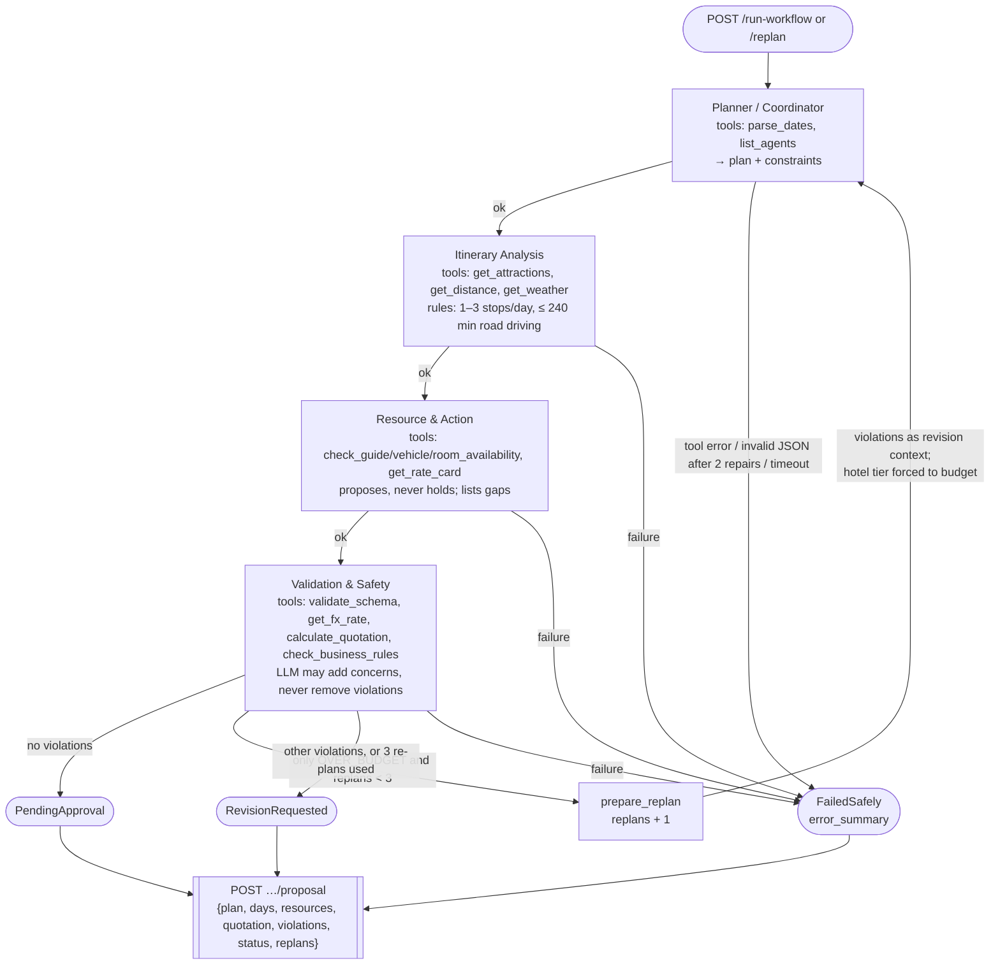

# Agent graph (LangGraph)

`agents/app/graph.py`. Every node is wrapped by `guarded()`: a `NODE_TIMEOUT_SECONDS` timeout (30 s default),
a last-resort error guard, a structured log line and a `POST …/steps` report to the API.

| Guard | Where |
|-------|-------|
| Tool allow-list (`ToolNotAllowed`) | `agents/app/tools/registry.py` |
| JSON output + repair loop (`MAX_RETRIES` = 2) | `agents/app/llm.py` (`call_json`) |
| Prompt-injection: inputs as escaped JSON inside one `<DATA>` block | `agents/app/nodes/common.py` (`wrap_data`, `DATA_RULES`) |
| Rules enforced in code, not only prompts | `agents/app/nodes/itinerary.py` (`check_days`), `resources.py` (`check_selection`, `missing_resource_gaps`), `validation.py` (`merge_verdict`), `tools/check_business_rules.py` |
| Re-plan limit (`MAX_REPLANS` = 3) | `agents/app/graph.py` (`after_validation`) |
