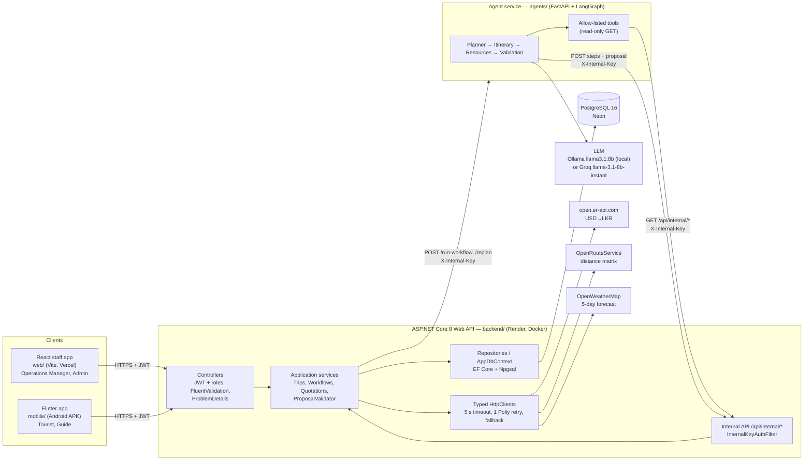

# System architecture

TripCraft's version of the assignment's reference architecture. Both clients talk **only** to the ASP.NET Core
API; the agent service is internal and reachable only with the `X-Internal-Key` header.

| Arrow | Code |
|-------|------|
| Clients → API | `web/src/shared/api/http.ts`, `mobile/lib/core/api/api_client.dart` |
| API → agent service | `backend/src/TripCraft.Infrastructure/Workflows/AgentServiceClient.cs` |
| Agent tools → internal API | `agents/app/tools/http_client.py`, `backend/src/TripCraft.Api/Controllers/Internal/` |
| Step reports and proposal → API | `agents/app/callbacks.py`, `backend/src/TripCraft.Api/Controllers/Internal/InternalWorkflowsController.cs` |
| API → third-party APIs | `backend/src/TripCraft.Infrastructure/External/` |
| Agents → LLM | `agents/app/llm.py` |
