# ER diagram

Generated from the EF Core model (`backend/src/TripCraft.Infrastructure/Persistence/Migrations/AppDbContextModelSnapshot.cs`
and the configurations in `Trips/`, `Resources/`, `Quotations/`, `Workflows/`, `Identity/` and `Persistence/Auditing/`).
Every table has `id uuid` (PK), `created_at` and `updated_at timestamptz`; money is `numeric(12,2)`; column names
are snake_case.

All 22 tables are in the database. Resource Management (guides, guide_languages, vehicles, hotels, room_types,
rate_cards, resource_holds, stop_check_ins) came in migration `AddResourceManagement`; Quotations (quotations,
quotation_lines, approval_decisions) came in `AddQuotations`.

```mermaid
erDiagram
    users ||--o| tourists : "has profile"
    users |o--o| guides : "guide login (unique user_id)"
    tourists ||--o{ trip_requests : submits
    trip_requests ||--o| itineraries : "has (unique trip_request_id)"
    itineraries ||--o{ itinerary_days : contains
    itinerary_days ||--o{ itinerary_stops : contains
    attractions ||--o{ itinerary_stops : "visited in"
    hotels |o--o{ itinerary_days : "night stay (hotel_id)"
    trip_requests ||--o{ agent_workflows : "planned by"
    agent_workflows ||--o{ agent_steps : records
    guides ||--o{ guide_languages : speaks
    hotels ||--o{ room_types : offers
    trip_requests |o--o{ resource_holds : "holds for"
    guides ||..o{ resource_holds : "resource_id (no FK)"
    vehicles ||..o{ resource_holds : "resource_id (no FK)"
    room_types ||..o{ resource_holds : "resource_id (no FK)"
    itinerary_stops ||--o| stop_check_ins : "checked in at"
    guides ||--o{ stop_check_ins : "checks in"
    trip_requests ||--o{ quotations : "priced by"
    agent_workflows |o--o{ quotations : proposes
    quotations ||--o{ quotation_lines : contains
    quotations ||--o{ approval_decisions : "decided by"
    users ||--o{ approval_decisions : "decided_by"

    users {
        uuid id PK
        varchar(256) email UK
        text password_hash
        varchar(32) role "Tourist | Guide | OperationsManager | Admin"
        varchar(200) full_name
        boolean is_active
    }
    tourists {
        uuid id PK
        uuid user_id FK,UK
        varchar(100) nationality
        varchar(20) passport_number_masked "last 4 only"
        varchar(500) passport_photo_url "private storage key"
    }
    trip_requests {
        uuid id PK
        uuid tourist_id FK
        text objective
        date start_date "check end_date >= start_date"
        date end_date
        int pax "check pax > 0"
        numeric budget_usd "numeric(12,2)"
        jsonb preferences
        varchar(32) status "index (status, start_date)"
    }
    attractions {
        uuid id PK
        varchar(200) name
        varchar(100) city "indexed"
        varchar(50) category
        int duration_minutes
        numeric entry_fee_lkr "numeric(12,2)"
        double latitude
        double longitude
        boolean is_deleted "soft delete"
    }
    itineraries {
        uuid id PK
        uuid trip_request_id FK,UK
        int version
        varchar(16) generated_by "Agent | Manual"
    }
    itinerary_days {
        uuid id PK
        uuid itinerary_id FK "unique (itinerary_id, day_number)"
        int day_number
        varchar(100) city
        uuid hotel_id FK "nullable"
        text notes
    }
    itinerary_stops {
        uuid id PK
        uuid itinerary_day_id FK "unique (itinerary_day_id, sequence)"
        uuid attraction_id FK
        int sequence
        time arrival_time
    }
    guides {
        uuid id PK
        uuid user_id FK,UK "null for a guide with no login"
        varchar(100) name
        varchar(30) phone
        numeric day_rate_lkr "check > 0"
        int max_pax "check > 0"
        boolean is_active
        boolean is_deleted "soft delete"
    }
    guide_languages {
        uuid id PK
        uuid guide_id FK "unique (guide_id, language_code)"
        varchar(2) language_code "indexed; check 2 letters"
    }
    vehicles {
        uuid id PK
        varchar(20) registration_no UK
        varchar(20) type
        int seats "check > 0"
        numeric rate_per_km_lkr "check > 0"
        boolean is_active
        boolean is_deleted "soft delete"
    }
    hotels {
        uuid id PK
        varchar(150) name
        varchar(100) city "indexed"
        int star_rating "check 1 to 5"
        double latitude
        double longitude
        boolean is_active
        boolean is_deleted "soft delete"
    }
    room_types {
        uuid id PK
        uuid hotel_id FK "unique (hotel_id, name)"
        varchar(60) name
        int capacity "check > 0"
        numeric rate_per_night_lkr "check > 0"
        int total_rooms "check > 0"
    }
    rate_cards {
        uuid id PK
        numeric margin_pct "numeric(5,2); check 0 to 100"
        date effective_from UK
    }
    resource_holds {
        uuid id PK
        varchar(16) resource_type "Guide | Vehicle | Room"
        uuid resource_id "guide, vehicle or room type id"
        uuid trip_request_id FK "null for a manual block"
        date from_date "check to_date >= from_date"
        date to_date
        int quantity "check > 0"
        varchar(16) status "Held | Released"
        varchar(300) note
    }
    stop_check_ins {
        uuid id PK
        uuid itinerary_stop_id FK,UK "one check-in per stop"
        uuid guide_id FK
        double latitude
        double longitude
        int distance_meters "check >= 0"
        timestamptz checked_in_at
    }
    quotations {
        uuid id PK
        uuid trip_request_id FK "unique (trip_request_id, version)"
        uuid workflow_id FK "nullable"
        int version "check >= 1"
        numeric subtotal_lkr "check total_lkr >= subtotal_lkr >= 0"
        numeric margin_pct "numeric(5,2)"
        numeric total_lkr
        numeric total_usd "check >= 0"
        numeric fx_rate "numeric(12,4); check > 0"
        timestamptz fx_as_of
        boolean fx_stale
        varchar(24) status "Pending | Approved | Rejected | RevisionRequested; index (status, created_at)"
        timestamptz accepted_at
    }
    quotation_lines {
        uuid id PK
        uuid quotation_id FK
        varchar(16) line_type "check guide | vehicle | room | entry"
        varchar(300) description
        numeric qty "check > 0"
        numeric unit_lkr "check >= 0"
        numeric amount_lkr "check >= 0"
    }
    approval_decisions {
        uuid id PK
        uuid quotation_id FK "indexed"
        uuid decided_by FK "users.id"
        varchar(24) decision "Approved | Rejected | RevisionRequested"
        varchar(1000) comment
        timestamptz decided_at
    }
    agent_workflows {
        uuid id PK
        uuid trip_request_id FK "indexed"
        text objective
        jsonb plan
        varchar(32) status "index (status, started_at)"
        varchar(100) current_step
        timestamptz started_at
        timestamptz finished_at
        jsonb final_outcome "proposal, then decision"
        jsonb validation_result "C# ProposalValidator"
        text error_summary
    }
    agent_steps {
        uuid id PK
        uuid workflow_id FK "unique (workflow_id, step_no)"
        int step_no
        varchar(32) agent_name
        varchar(200) tool_name
        jsonb input_summary
        jsonb output_summary
        jsonb validation_result
        int duration_ms
        int retries
        varchar(32) status
    }
    audit_logs {
        uuid id PK
        uuid actor_id "null for system actions"
        varchar(100) action
        varchar(100) entity
        uuid entity_id
        jsonb before
        jsonb after
        timestamptz at
    }
    city_distances {
        uuid id PK
        varchar(60) from_city "unique (from_city, to_city)"
        varchar(60) to_city
        numeric distance_km "check > 0"
        int duration_minutes "check > 0"
    }
```

**`resource_holds` details:** `resource_id` points at a guide, vehicle or room type, chosen by `resource_type`, so it
has no foreign key (dotted lines above). An index covers `(resource_type, resource_id, from_date, to_date)`. The
migration `AddResourceManagement` enables the `btree_gist` extension and adds the exclusion constraint
`ex_resource_holds_no_overlap`: no two `Held` holds of the same guide or vehicle may have overlapping dates
(`daterange(from_date, to_date, '[]')`, both ends inclusive). Room holds are not in the constraint; the service
checks them against `room_types.total_rooms` per night.

**Delete behaviour:** these rows cascade with their parent: itinerary days and stops, agent steps (with their
workflow), guide languages (with their guide), quotation lines (with their quotation) and stop check-ins (with their
itinerary stop). Every other foreign key is `RESTRICT`. `audit_logs` has no foreign keys on purpose (it must
outlive the rows it describes).

## Seed data

`backend/src/TripCraft.Infrastructure/Persistence/Seeding/DataSeeder.cs` runs on every start and calls the other
seeders. Each part has its own rule:

- **Users** are added only when the `users` table is empty.
- **Attractions** (by name), **hotels** with their room types (by fixed id) and **city distances** (by city pair)
  are topped up on every start. Only missing rows are added, so an existing database picks up new seed rows
  without duplicates.
- **Guides, vehicles and the rate card** are added only on the first run (when the `guides` table is empty). The
  sample trip's hotels and holds are linked on that run too.
- **Tourist profiles** are added for any seeded tourist user that has none.
- The **sample trip** is added only when `trip_requests` is empty, and its **quotation** only when `quotations` is
  empty.

| Table | Rows | Seeder |
|-------|------|--------|
| `users` | 12: 3 per role (`tourist1-3`, `guide1-3`, `manager1-3`, `admin1-3` `@tripcraft.test`) | `DataSeeder` |
| `attractions` | 21 in six cities: Colombo 2, Kandy 4, Ella 4, Galle 5, Nuwara Eliya 3, Sigiriya 3. A 5-day trip always has at least one unused stop per day. | `Trips/TripsSeeder.cs` |
| `tourists`, `trip_requests`, `itineraries` | one profile per seeded tourist; one Completed 3-day Kandy + Ella sample trip for the reports | `Trips/TripsSeeder.cs` |
| `guides`, `guide_languages` | 4: Nimal (en, si, LKR 6,000/day, `guide1`), Kumari (en, de, 6,500, `guide2`), Ruwan (en, fr, ja, 7,000, `guide3`), Anjali (en, zh, 7,500) | `Resources/ResourcesSeeder.cs` |
| `vehicles` | 3: Van CAB-1234 (6 seats), Car CAR-9876 (3), Coach NC-4455 (15) | `Resources/ResourcesSeeder.cs` |
| `hotels`, `room_types` | 6 hotels, one per attraction city, with 2 room types each | `Resources/ResourcesSeeder.cs` |
| `rate_cards` | margin 15 % | `Resources/ResourcesSeeder.cs` |
| `resource_holds` | the sample trip's holds: Nimal, van CAB-1234, and one room-night each at Kandy Hills and Ella Gap | `Resources/ResourcesSeeder.cs` |
| `city_distances` | 15: every pair of the six cities (fallback for OpenRouteService) | `Workflows/WorkflowsSeeder.cs` |
| `quotations`, `quotation_lines`, `approval_decisions` | the sample trip's approved quotation (6 lines) and its Approved decision by a manager | `Quotations/QuotationsSeeder.cs` |
