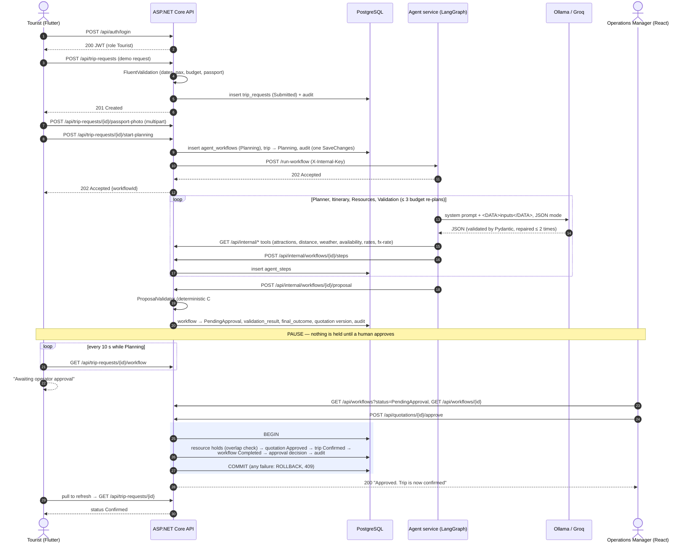

# The assessed workflow (PLAN.md section 6)

From the tourist's request to the confirmed trip, including the pause for human approval.

**Second path (safe failure):** budget USD 400 → Validation finds `OVER_BUDGET` → the graph re-plans with the budget
hotel tier; if still over budget the API sets `RevisionRequested` and the manager can request a revision
(`POST /api/quotations/{id}/request-revision`, which calls the agent's `/replan`).

**Current state:** the Resource Management (Student B) and Quotations (Student C) steps are served by placeholder
ports that answer 503 until those components are merged, so a live run ends `FailedSafely` at the Resources agent
(see `docs/TEST-EVIDENCE.md`).
